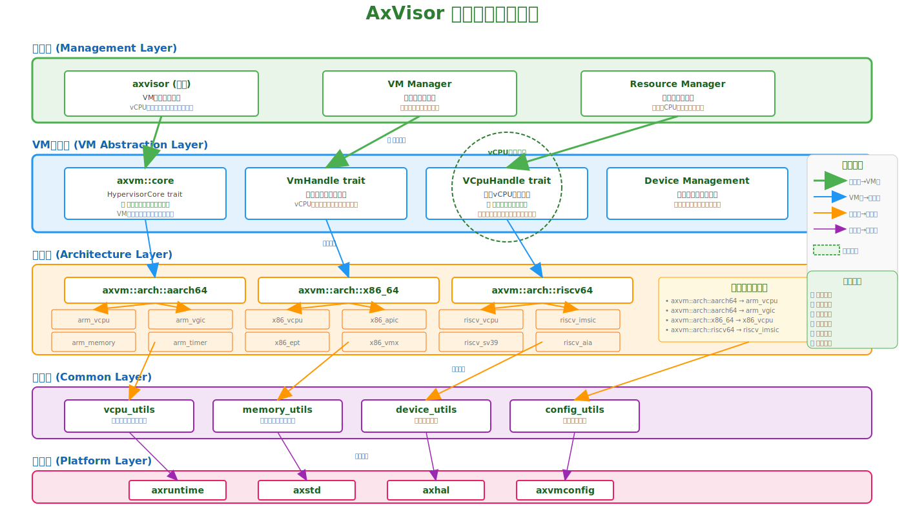

# AxVisor 架构重构分析

## 概述

本文档分析了当前AxVisor架构中存在的问题，并提出相应的重构建议。通过分析现有代码结构和组件关系，识别出了三个主要的架构问题。

## 现有架构问题

### 1. 架构相关条件编译分散

**问题描述：**
包括 `axvisor`、`axvm`、`axvcpu`、`axaddrspace`、`arm_vcpu`、`arm_vgic`、`axvmconfig`、`axdevice`、`axvisor-api` 等组件，均存在大量的架构相关条件编译代码。

**具体表现：**
```rust
// 在多个模块中重复出现
#[cfg(target_arch = "aarch64")]
// ARM64特定代码

#[cfg(target_arch = "x86_64")]
// x86_64特定代码

#[cfg(target_arch = "riscv64")]
// RISC-V特定代码
```

**影响分析：**
- **代码重复**: 相同功能的架构特定代码分散在多个模块中
- **维护困难**: 修改架构相关逻辑需要在多个地方同步更新
- **可读性差**: 大量条件编译使代码逻辑难以理解
- **扩展性差**: 添加新架构支持需要修改多个组件

### 2. API接口不统一

**问题描述：**
同一个库中同时使用多种不同的接口风格，包括trait直接作为接口、axvisor-api外部函数和extern "C"函数。

**具体表现：**

#### 2.1 Trait接口
```rust
trait AxVMHal {
    fn run(&mut self) -> AxResult<()>;
}

trait AxVCpuHal {
    fn switch(&mut self, next: &Self) -> AxResult<()>;
}
```

#### 2.2 extern "C"函数
```rust
#[no_mangle]
unsafe extern "C" fn run_guest() -> usize;

extern "C" {
    fn exception_vector_base_vcpu();
}
```

#### 2.3 axvisor-api外部函数
```rust
// 通过axvisor-api暴露的外部函数接口
extern "C" {
    fn axvisor_inject_irq(vcpu_id: u32, irq_id: u32);
    fn axvisor_set_vcpu_state(vcpu_id: u32, state: *mut VCpuState);
}
```


**影响分析：**
- **接口混乱**: 开发者不清楚应该使用哪种接口风格
- **类型安全差**: extern "C"函数缺乏编译时类型检查
- **测试困难**: 混合接口风格难以编写统一的测试
- **维护成本高**: 接口变更影响面大且难以追踪

### 3. 组件职责不清晰

**问题描述：**
axvisor既包括管理虚拟机的功能，也包括底层的硬件抽象功能(ARM中断注入)，各组件职责边界模糊，功能重叠严重。

### 4. vCPU抽象层设计过度复杂

**问题描述：**
axvcpu本意是设计为抹除架构间vcpu差异，但实际是各架构差异较大，在这一层抹除差异造成接口过度复杂，无法根据特性优化。

#### 4.1 架构差异分析
**vCPU核心功能差异：**

| 功能特性 | ARM64 | x86_64 | RISC-V | 抽象复杂度 |
|---------|-------|--------|--------|-----------|
| **虚拟化扩展** | VHE/VNCR | VMX | H-extension | ⭐⭐⭐ |
| **上下文切换** | EL2/EL1切换 | VMCS管理 | HSTATE管理 | ⭐⭐⭐ |
| **异常处理** | Syndrome解析 | Exit Reason | Exit Cause | ⭐⭐ |
| **内存管理** | Stage-2页表 | EPT/NPT | Sv-39页表 | ⭐⭐⭐ |
| **寄存器模型** | 通用+系统寄存器 | 通用+MSR | 通用+CSR | ⭐⭐ |

**虚拟中断控制器差异对比：**

| 特性 | ARM vGIC | Intel APIC | RISC-V IMSIC | 接口统一难度 |
|------|----------|------------|--------------|-------------|
| **消息传递** | SGI/ID/PPI | LAPIC/IOAPIC | MSI | ⭐⭐⭐⭐⭐ |
| **路由机制** | Affinity/Target | Fixed/Lowest | AIA | ⭐⭐⭐⭐ |
| **优先级** | 32级优先级 | 8级优先级 | 配置优先级 | ⭐⭐⭐ |
| **虚拟化支持** | vGICv2/vGICv3 | APICv | IMSIC+HVIP | ⭐⭐⭐⭐⭐ |
| **配置接口** | Distributor | MSR访问 | MMIO访问 | ⭐⭐⭐⭐ |

#### 4.2 过度抽象带来的问题

**接口复杂度过高：**
```rust
// 当前axvcpu尝试统一所有架构差异的复杂接口
trait AxVCpuHal {
    // ARM64特有的VHE管理
    fn configure_vhe(&mut self, enabled: bool) -> Result<()>;

    // x86_64特有的VMCS操作
    fn vmcs_read(&self, field: VmcsField) -> Result<u64>;
    fn vmcs_write(&mut self, field: VmcsField, value: u64) -> Result<()>;

    // RISC-V特有的H扩展管理
    fn hstate_read(&self, offset: usize) -> Result<u64>;
    fn hstate_write(&mut self, offset: usize, value: u64) -> Result<()>;

    // 中断控制器统一接口
    fn inject_interrupt(&mut self, irq: UniversalInterrupt) -> Result<()>;
}
```

**性能损失：**

- **特性限制**：无法利用架构特有功能进行优化
- **内存浪费**：维护所有架构的数据结构

**维护困难：**

- **接口膨胀**：每个架构的新特性都需要修改统一接口
- **测试复杂**：需要测试所有架构组合的功能
- **调试困难**：抽象层掩盖了底层实现细节

#### 4.3 求同存异的设计理念

**相似功能函数组合，而非强制统一接口：**

```rust
// 新的设计理念：核心相似功能抽象，架构特性独立
mod axvm {
    // VM层统一接口，抹除架构差异
    pub trait Vm {
        fn create_vcpu(&mut self, config: VCpuConfig) -> Result<Box<dyn VCpuHandle>>;
        fn run_vm(&mut self) -> Result<VMExit>;
        fn allocate_memory(&mut self, size: usize) -> Result<MemoryRegion>;
    }

    // vCPU句柄接口，仅暴露必要操作
    pub trait VCpuHandle {
        fn id(&self) -> VCpuId;
        fn run(&mut self) -> Result<VCpuExit>;
        fn set_state(&mut self, state: VCpuState) -> Result<()>;
    }
}
```

**功能函数组合而非继承：**

```rust
// 公共功能函数库
pub mod vcpu_common {
    // 通用算法
    pub fn parse_guest_registers(state: &[u8]) -> Vec<Register>;
    pub fn validate_memory_permissions(perms: u32) -> bool;
    pub fn calculate_page_table_size(guest_size: usize) -> usize;

    // 数据结构转换
    pub fn state_to_axvm(state: &GuestState) -> VCpuState;
    pub fn axvm_to_state(vm_state: VCpuState) -> GuestState;
}

// 架构特定功能函数
pub mod aarch64_funcs {
    use super::vcpu_common::*;

    pub fn configure_vgic_v3(vgic: &mut VGicV3, config: VGicConfig) -> Result<()> {
        // ARM64特有的vGICv3配置逻辑
        validate_memory_permissions(config.its_perms)?;
        // ...
    }
}
```

#### 3.1 axvisor职责混乱
```rust
// 高层管理功能
mod vmm {
    fn create_vm(config: VMConfig);     // VM生命周期管理
    fn schedule_vcpus();                // vCPU调度
    fn allocate_resources();            // 资源分配
}

// 底层硬件抽象功能
mod hal {
    fn arm_inject_irq(vcpu_id, irq_id); // ARM中断注入
    fn write_sys_reg(reg, value);       // 系统寄存器操作
    fn handle_vmexit();                 // 底层异常处理
}
```

#### 3.2 组件间功能重叠
- **axvm vs axvisor**: VM管理功能重叠
- **axvcpu vs arm_vcpu**: vCPU抽象与具体实现混合
- **axaddrspace vs axvm**: 内存管理职责重叠
- **axvmconfig**: 配置管理与运行时功能混合

**影响分析：**
- **耦合严重**: 高层功能依赖底层实现细节
- **测试困难**: 无法独立测试各组件功能
- **扩展性差**: 修改一个组件可能影响多个其他组件
- **维护成本高**: 问题定位困难，修改风险大

## 重构建议

### 1. 架构分层重构

#### 1.1 建议的新分层架构

**管理层 (axvisor)**: 负责虚拟机的高层管理逻辑，如VM生命周期管理、vCPU调度和资源分配。

**VM层 (axvm)**: 提供统一的虚拟化抽象接口，定义trait和基础类型，协调各架构实现，提供给axvisor的接口已抹除架构差异。

**架构层 (axvm/arch)**: 实现架构特定的虚拟化功能，为axvm接口提供实现，隔离架构相关代码，每个架构独立维护。每个架构模块内部依赖具体的实现组件。

**架构实现层**: 包含具体的架构实现模块，如arm_vcpu、arm_vgic、x86_vcpu等，为架构层提供底层功能支持。

**架构共性层 (axvm/common)**: 在vm层级内，提供各架构通用的辅助功能和工具函数，减少重复代码。

#### 1.2 VM层抹除差异的新设计原则

**核心设计理念转变：**

从"vCPU层抹除差异"转变为"VM层抹除差异，vCPU求同存异"

**VM层统一接口设计：**

```rust
// axvm/core/mod.rs - VM层统一接口
pub trait HypervisorCore {
    type VM: VmHandle;
    type Error: Debug + Send + Sync;

    fn create_vm(&mut self, config: VMConfig) -> Result<Self::VM, Self::Error>;
    fn destroy_vm(&mut self, vm: Self::VM) -> Result<(), Self::Error>;

    // 统一的VM管理接口，架构差异在此层被隐藏
    fn allocate_memory(&mut self, vm: &mut Self::VM, size: usize, flags: MemoryFlags)
        -> Result<MemoryRegion, Self::Error>;

    fn attach_device(&mut self, vm: &mut Self::VM, device: DeviceConfig)
        -> Result<DeviceHandle, Self::Error>;
}

pub trait VmHandle {
    type VCpu: VCpuHandle;
    type Error: Debug + Send + Sync;

    fn id(&self) -> VmId;
    fn state(&self) -> VmState;

    // 统一的vCPU创建接口，但允许架构特性
    fn create_vcpu(&mut self, config: VCpuConfig) -> Result<Self::VCpu, Self::Error>;
    fn destroy_vcpu(&mut self, vcpu: Self::VCpu) -> Result<(), Self::Error>;

    // 统一的内存管理接口
    fn map_guest_memory(&mut self, guest_addr: GuestAddr, host_addr: HostAddr, size: usize, perms: MemoryPermissions)
        -> Result<(), Self::Error>;
}

// 简化的vCPU接口，仅暴露核心操作
pub trait VCpuHandle {
    type Error: Debug + Send + Sync;

    fn id(&self) -> VCpuId;
    fn state(&self) -> VCpuState;

    // 核心生命周期操作
    fn run(&mut self) -> Result<VCpuExit, Self::Error>;
    fn pause(&mut self) -> Result<(), Self::Error>;
    fn resume(&mut self) -> Result<(), Self::Error>;

    // 基础状态管理
    fn set_registers(&mut self, regs: &CPURegisters) -> Result<(), Self::Error>;
    fn get_registers(&self) -> Result<CPURegisters, Self::Error>;

    // 简化的中断注入，架构特性通过配置体现
    fn inject_interrupt(&mut self, irq_type: InterruptType, vector: u32) -> Result<(), Self::Error>;
}
```

**架构层保留差异化特性：**

```rust
// axvm/arch/aarch64/mod.rs - ARM64架构实现
pub struct AArch64VM {
    // ARM64特有的管理结构
    vttbr: u64,
    vmid: u32,
    vcpus: Vec<AArch64VCpu>,
    vgic: Option<VGic>,
}

impl AArch64VM {
    // ARM64特有功能，不暴露给VM层
    pub fn configure_vhe(&mut self) -> Result<(), AArch64Error> { /* ... */ }
    pub fn setup_vgic_v3(&mut self, config: VGicConfig) -> Result<(), AArch64Error> { /* ... */ }
    pub fn configure_stage2(&mut self, config: Stage2Config) -> Result<(), AArch64Error> { /* ... */ }

    // 利用ARM64特性优化的内存管理
    pub fn allocate_contiguous_memory(&mut self, size: usize) -> Result<MemoryRegion, AArch64Error> {
        // 利用ARM64的大页支持
        if size >= PAGE_SIZE_2M && self.supports_hugepages() {
            self.allocate_hugepages(size)
        } else {
            self.allocate_regular_pages(size)
        }
    }
}

impl crate::core::VmHandle for AArch64VM {
    fn create_vcpu(&mut self, config: VCpuConfig) -> Result<Self::VCpu, Self::Error> {
        let mut vcpu = AArch64VCpu::new(config)?;

        // ARM64特有初始化
        if config.enable_vhe {
            vcpu.configure_vhe()?;
        }

        if let Some(vgic_config) = config.vgic_config {
            vcpu.setup_vgic(vgic_config)?;
        }

        Ok(vcpu)
    }

    fn allocate_memory(&mut self, size: usize, flags: MemoryFlags) -> Result<MemoryRegion, Self::Error> {
        // 根据ARM64特性选择最优分配策略
        if flags.contains(MemoryFlags::HUGEPAGE_SUPPORT) && self.supports_hugepages() {
            self.allocate_hugepages_optimized(size)
        } else {
            self.allocate_standard_memory(size)
        }
    }
}
```


